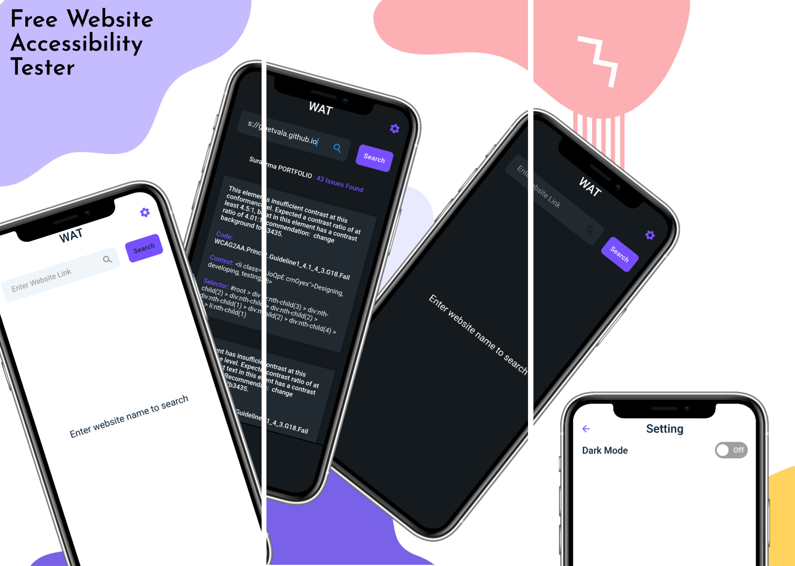
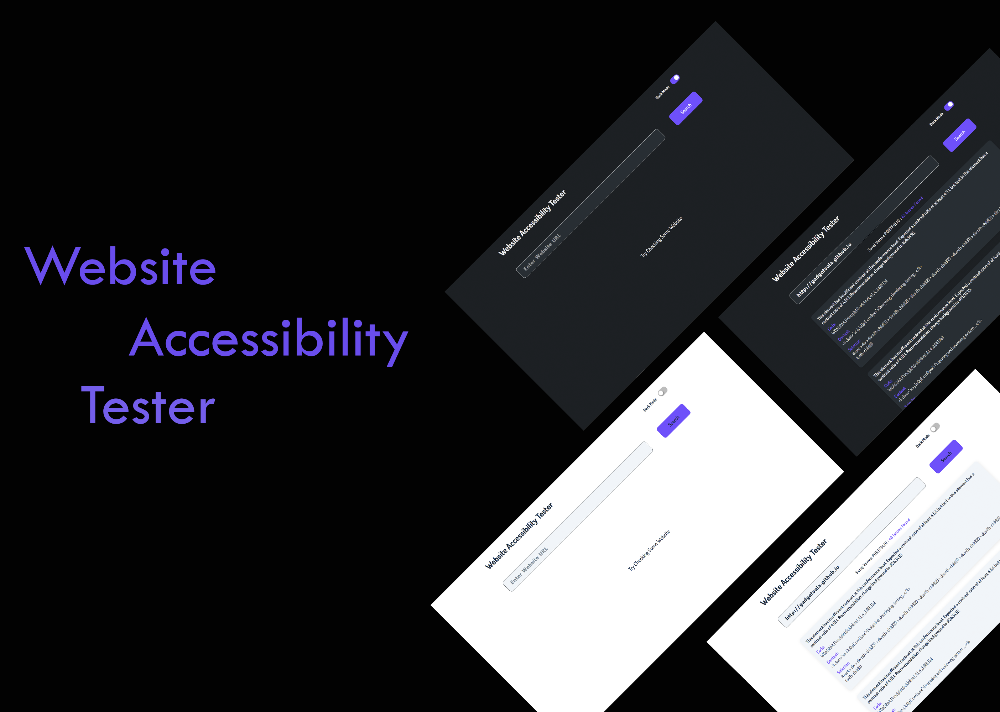

# Introduction

> “Website Accessibility Tester”
> is simple tool to test websites built for different Platforms.

### <i>Checkout Different folder for Demo & Details Informations</i>

## 🚀 &nbsp;[Flutter](https://github.com/gadgetvala/website_accessibility_tester/tree/main/2.flutter)

## 🚀 &nbsp;[Next.JS](https://github.com/gadgetvala/website_accessibility_tester/tree/main/3.nextjs)

## :clap: Done

Feel free to **file a new issue** with a respective title and description on the the [Website Accessibility Tester](https://github.com/gadgetvala/website_accessibility_tester/issues) repository. If you already found a solution to your problem, **I would love to review your pull request**!

## 📘&nbsp; License

TheWebsite Accessibility Tester app is released under the under terms of the [MIT License](LICENSE).

## :heart: Contributor

Made by [Suraj Verma](https://github.com/gadgetvala)
